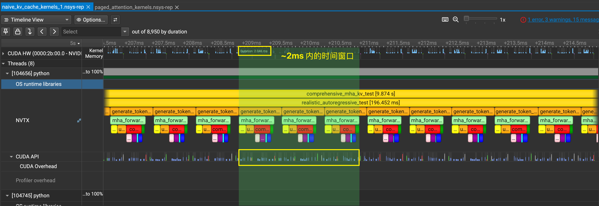
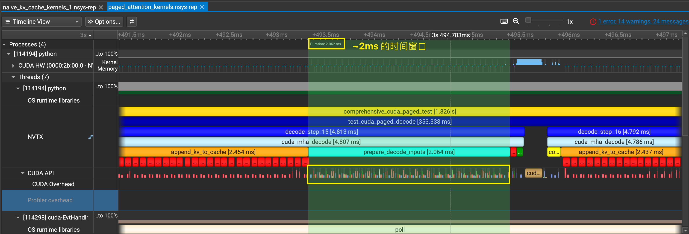

## What is this project?
为了更好理解 Transformer 内部结构和优化策略，本项目从头使用 PyTorch 开始构建 Transformer，以便对于位置编码、多头注意力、掩码等操作有更深的理解。

## How to start?
### Construct the virtual environment
环境使用 `uv` 进行搭建，并且已经完全配置好了所有需要的依赖。具体构建方式如下：

```bash
# 同步所有的依赖项并且构建环境
uv sync
# 激活构建好的虚拟环境
source .venv/bin/activate
```

## Naive Implementation of Transformer
### Download the dataset file and process

```bash
# 下载并处理成需要的binary文件
python3 naive_attention/data/get_dataset.py
```

### Run the training script

```bash
python naive_attention/train.py
```

## Optimization
### Flash Attention
对于 Flash Attention 背后的数学原理在 [FlashAttentionDesc](./flash_attention/FlashAttentionDesc.md) 这篇文章里面可以看到。之后有一个使用 CUDA 实现的简单代码，
没有在 SGEMM 矩阵乘法方面做优化，因此效率会比预期低很多。

项目已经在 `pyproject.toml` 中配置好了包路径要求，但是编译环境依赖于 PyTorch Extension，因此必须使用 uv 同步环境，安装好 torch 依赖项。
这里对实现好的 CUDA 代码提供了一种快速的 `JIT` 编译方法，运行方法如下：

```bash
# 运行脚本的时候会自动根据 __init__.py 中的要求编译源代码
python -m test.test_flash_attention
# 使用结束之后可以手动清除 JIT 缓存
rm -rf ~/.cache/torch_extensions/py3XX_cu1XX/flash_attention_cuda/
```

第一次运行的时候会花很多时间进行编译 Flash Attention，之后就会写进缓存中不再需要编译。

### KV Cache
对于推理阶段，由于上下文过长带来的计算难度指数级上升的问题，KV Cache通过「空间换时间」的做法，通过保存住计算过程中的 K、V 中间量，
能够用线性增长的空间换取指数级下降。一般的 KV Cache 技术可以在 PyTorch 层面进行编写，因此根据 KV Cache 的思想实现了一个简易版本。运行方法如下：

```bash
# 运行脚本的时候会自动根据 __init__.py 中的要求编译源代码
python -m test.test_kv_cache
```

在简单 KV Cache 的实现这一部分，如果想要使用 Nsight Toolkits 去分析性能，我们可以补充安装一些 Profiling 的依赖项：

```bash
# 切换到这个分支之后，会自动安装 pyproject.toml 中的 profiling 依赖项
uv sync --extra profiling
# 查看一下自己的 CUDA version，我的是 12.7，因此根据向后兼容我选择安装 12.6（NSight必须版本对应）
nvidia-smi | grep CUDA
# 安装非图形化界面的 nsys 依赖
wget https://developer.nvidia.com/downloads/assets/tools/secure/nsight-systems/2025_5/NsightSystems-linux-cli-public-2025.5.1.121-3638078.deb
dpkg -i NsightSystems-linux-cli-public-2025.5.1.121-3638078.deb
# 获取 Kernel 性能报告（cuda kernel、内存等基本报告）
mkdir nvtx_report
nsys profile -o nvtx_report/naive_kv_cache_kernels \
    --trace=cuda,nvtx,osrt \
    --cuda-memory-usage=true \
    --force-overwrite=true \
    python -m test.test_kv_cache_nvtx
```

然后在自己电脑上根据这个[链接](https://developer.nvidia.com/nsight-systems/get-started)找到适合自己平台的版本，且一定要匹配我们下的2025.5.1.121
版本，否则会无法打开report。我们对比一下简单的 KV Cache 方法对比 Paged Attention 方法（在下文），CUDA 活动和吞吐量的差异。





由于两种实现的算法逻辑和内存布局不同，我们选择固定的时间窗口（约2ms）来公平比较GPU资源的利用效率。选择固定时间原因是，当我们保持 GPU 核心的时钟
数基本相同，哪一边操作数更多，说明吞吐量越大，GPU 性能发掘的越完全。

在相同的硬件条件和时间窗口下，Paged Attention 展现出更密集的 CUDA 内核活动，这表明：

1. **更高的GPU利用率**: 减少了GPU空闲时间
2. **更优的内存访问模式**: 分页机制减少了内存带宽浪费  
3. **更好的执行流水线**: 计算和内存操作重叠更充分

这种差异的根本原因是PagedAttention的分页内存管理避免了传统方法中，内存碎片化导致的带宽浪费、大量padding tokens的无效计算、
内存分配/释放的额外开销等问题。这从一个很直观的角度说明了 Paged Attention 的强大之处，这也是 vLLM 等框架能够显著提升推理吞吐量的核心技术原理之一。

### Grouped-Query Attention
是一种对于 Multi-head Attention 的优化形式，本质上是通过牺牲一些参数换取更小的内存占用和训练速度。
GQA 让所有的 Head 之间共享同样的一份 K 和 V 矩阵（意味K和V的计算唯一），只让 Q 保留了原始多头的性质，从而大大减少 K 和 V 矩阵的参数量以及 
KV Cache的显存占用，以此来达到提升推理速度，但是会带来精度上的损失。


```bash
python -m test.test_grouped_query_attention
```

### Linear Attention
对于一个输入长度为 $n$ 的输入序列，当 $n$ 远大于特征长度 $d$ 时，矩阵乘法的时间复杂度约为 $O(n^2)$。
Linear Attention 的最重要的改动是使用机器学习中的核函数的思想去掉了 Self-Attention 的 softmax，然后使用矩阵乘法的交换律先计算了
$K^T$ 和 $V$ 的矩阵乘法，因此 Linear Attention 的时间复杂度和空间复杂度都是 $O(n^2)$。


```bash
python -m test.test_linear_attention
```


### Sparse Attention
稀疏注意力是一种降低部分精度但换来更优空间的一种做法。我们换一种角度思考 $Q\cdot K^T$ 在做什么：由于 $Q$ 和 $K$ 是同一个来源，
所以相当于自己和自己全部内容做了全连接「计算」，当 `context_length` 很长的时候，这样的一个矩阵会变得巨大且低秩。因此传统的Transformer（也被
称为Dense Attention）用的是全连接「计算」，这里的 Sparse Attention 是稀疏运算，但是会满足几个「采样」规则。


```bash
python -m test.test_sparse_attentio
```
 
### RoPE Position Encoding
RoPE 是一种旋转位置编码方式，与传统的sin/cos编码的区别在于，它不在意全局的“GPS”坐标，而是更在于当前“相对位置”的token应该关注哪些上下文。
核心数学原理：对于查询向量 $q$ 在位置 $m$，应用旋转: $f(q, m)$，对于键向量 $k$  在位置 $n$，应用旋转: $f(k, n)$，注意力分数: $f(q,m)\cdot f(k,n)$。
由于旋转的性质，$f(q,m)\cdot f(k,n)>$ = $f(q,0)\cdot f(k,n-m)$，这意味着注意力分数只依赖于相对位置差 $(n-m)$，而不是绝对位置。


```bash
python -m test.test_rope_encoding
```

### Paged Attention (vLLM)
Paged Attention 启发自 OS 里面的分页内存。为了减少内存碎片和连续内存造成的冗余，Paged Attention 在系统底层层面对内存进行管理，使用分页机制，
将可分配的内存划分为连续的格子。每次请求内存的时候开辟一段新格子存储 tokens，并且用 block table 来记录存放的位置和顺序。

据 Paged Attention 的发明人 Zhuohan 表示，这样的好处有以下几点：
> 1. Reduce memory fragmentation with paging
> 
> 2. Further reduce memory usage with sharing
 
具体的介绍文档参考 [PagedAttentionDesc](paged_attention/PagedAttentionDesc.md)，启动编译和运行的方式如下：

```bash
# 运行脚本的时候会自动根据 __init__.py 中的要求编译源代码
python -m test.test_paged_attention
# 这部分会比 Flash Attention 更加慢一些
```

如果想要对比简单 KV Cache 的实现和 Paged Attention 的性能对比，我们可以使用 Nsight 进行性能评估，操作如下：

```bash
# 切换到这个 profiling 这个分支
uv sync --extra profiling
# 假设在之前 KV Cache 的步骤中，你已经安装好了 nsight 相关组件
nsys profile -o nvtx_report/paged_attention_kernels \
    --trace=cuda,nvtx,osrt \
    --cuda-memory-usage=true \
    --force-overwrite=true \
    python -m test.test_paged_attention_nvtx
```