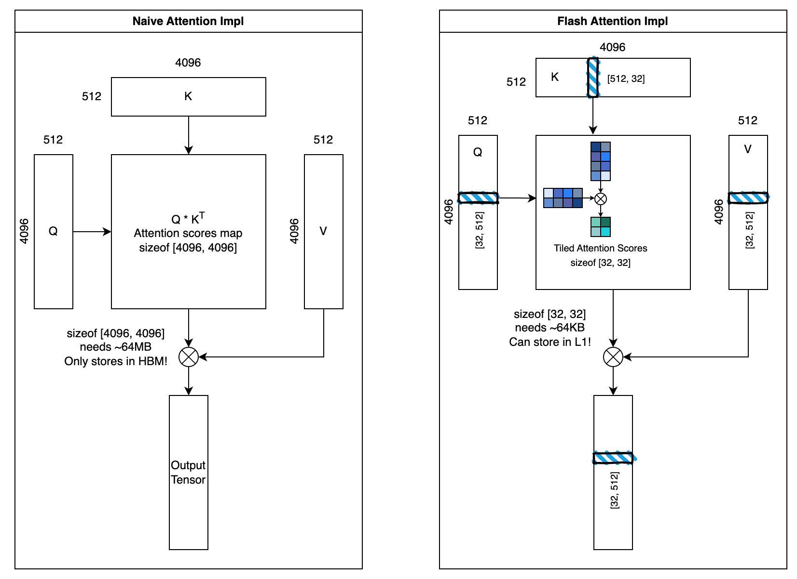

# Flash Attention 详解

## Flash Attention 图示

这是一个简单的流程展示：

思路其实不复杂，就是把原来需要大量 HBM IO 操作转移到了 L1 Cache（GPU中用的是SRAM）中。在 CUDA 编程那部分我们已经了解到 SRAM 的速度大约是 1-3 cycles（~3TB/s），而 HBM 的速度为上百 cycles。但是由于 L1 Cache 非常的小，通常只有 128KB、192KB，因此无法把大规模矩阵运算放入，因此 Flash Attention 进行了矩阵分块的乘法操作。

> 说的更专业一些：Flash Attention 的本质是 **IO-aware 的注意力实现**：通过把计算**分块（tiling）重排**，让 Q/K/V 对 **HBM 的读写次数降到 O(1)** 量级，并把中间算子（scale、mask、softmax、与 V 相乘）尽量放在**片上寄存器 / Shared Memory（片上 SRAM）\**里完成，从而\**不显式生成 N×N 的注意力分数/概率矩阵**，大幅减少 HBM 流量与显存占用。

假设我们有一个很长的向量，比如 4096 tokens 的长度，以及 512 的词嵌入宽度。那么我们一次传入的矩阵大小来到了 4096×512。之前的做法是，我们让 GPU 核心与 HBM 中数据进行通信，但是由于带宽的限制，计算会受制于 DRAM 的 IO。但是我们可以设置一个合理的分块大小，比如 32，那么每一次我们要做的就是如下操作：

1. 设置大循环，每次读入 32×512 个数据从 HBM 到 L1 cache，总共进行 4096 / 32 次写入读取操作，大幅降低了与 HBM 的通信延迟；
2. 我们只关注这 32×512 大小的矩阵与其转置。将其做矩阵的乘法 $Q_{block}\cdot K_{block}^T$ 形成一个注意力分数；
3. 对这部分注意力分数进行mask、softmax、dropout操作（此时已经经过底层优化后变成了一个 fusion kernel）；
4. 把最后的结果与 $V_{block}$ 进行最后的矩阵乘法操作，得到了输出向量的一部分。

> 注意：`mask` 和 `dropout` 可以在块内就地应用；**softmax 虽不能对每个块独立求出全局结果**，但可用“**在线 softmax**”在块间**增量更新**，最终与一次性全局 softmax 等价。难点在于如何在分块计算中维护每行的**运行最大值**与**归一化常数**。

$$
\text{Softmax}(x_{i})=\frac{e^{x_{i, j}}}{\sum^{d_{model}}_{j=1}{e^{x_{i, j}}}}
$$

## 分块矩阵中的 Softmax 处理

这是 Flash Attention 最贴近数学优化的一条策略。这个问题可以换一种问法：我们只做局部的分块矩阵，如何根据局部的 softmax 信息来获取到全局的 softmax 信息？

这里用到了一种被称为 online Softmax 的计算方法，通过维护两个局部变量（来保持“记忆”），我们就能从中计算出全局信息。首先是一个最基本的数学性质，这是由于可以上下同乘以常数 $c$ 即可获得：

$$
\text{Softmax}(x)=\text{Softmax}(x+c)
$$

在数值计算中，我们通常会减去向量中的最大值 `m = max(x)` 来防止 $e^{x_i}$ 因为 $x_i$ 过大而溢出。公式就变成了：

$$
m = max_j(x_j)
$$

$$
\text{Softmax}(x_{i})=\frac{e^{x_{i}-m}}{\sum^{N}_{j=1}{e^{x_{j}-m}}}
$$

由上面的公式可知，如果我们要求一个向量的 softmax，我们需要知道全局的最大值，以及知道全局的分母（是个定值），那么每个元素都可以根据上面的公式计算出自己 softmax 的值。我们在算法的过程中，维护一对过程中的当前最大值 $m$ 以及当前分母之和 $L$。我们使用**数学归纳**的方法，假设我们经过分片之后，一个大矩阵被分成了若干块： $X = [X_1, X_2, ..., X_N]$ ，一开始的 $m = -inf, L = 0$。

对于第一个数据块 $X_1$：
它的最大值是 $m_1 = \max(X_1)$，同时更新全局最大值 $m = \max(m_1, m) = m_1$，然后计算出此时的分母之和 $L_1 = \sum_{i=1}^{n} e^{x_i - m_1}$，那么初始条件就已经获取到了。

对于第二个数据块 $X_2$：
它的最大值是 $m_2 = \max(X_2)$，同时可以更新全局最大值 $m = \max(m_2, m_1)$，然后计算出此时的分母之和 $L_2 = \sum_{i=1}^{n} e^{x_i - m_2}$，因为 $m_2$ 和 $L_2$ 是我们在当前步骤可以**直接计算出来**的。对于 $X_2$，它无法看到之前的数据块 $X_1$，因此我们的核心任务是：仅使用已知的 $m_1, L_1$ 和新计算的 $m_2, L_2$ 来推导出当前的 $L$ 的值。

我们把目前的全局分母 $L$ 的求和拆分成两部分：

$$
 L=\sum^{n}_{i=1}{e^{x_i-m}}+\sum^{2n}_{j=n+1}{e^{x_j-m}}
$$

同时我们运用一个幂计算方法： $e^{a-c} = e^{a-b+b-c} = e^{a-b} \cdot e^{b-c}$ ，我们把第一部分与自己局部的 $m_1$ 联系起来，第二部分与自己局部的 $m_2$ 联系起来：

**第一项**：

$$
e^{x_i-m}=e^{x_i-m_1+m_1-m}=e^{x_i-m_1}\cdot e^{m_1-m}
$$

第一项求和为：

$$
\sum_{i=1}^{n}{e^{x_i-m}}=\sum_{i=1}^{n}{e^{x_i-m_1}\cdot e^{m_1-m}}
$$

因为 $e^{m_1 - m}$ 对于这个求和来说是一个常数，可以提到外面，同时剩余部分正是 $L_1$ 的定义：

$$
\sum_{i=1}^{n}{e^{x_i-m}}=e^{m_1-m} \cdot \sum_{i=1}^{n}{e^{x_i-m_1}}=e^{m_1-m} \cdot L_1
$$

**第二项**：

$$
e^{x_j-m}=e^{x_j-m_2+m_2-m}=e^{x_j-m_2}\cdot e^{m_j-m}
$$

第二项求和为：

$$
\sum_{j=n+1}^{2n}{e^{x_j-m}}=\sum_{j=n+1}^{2n}{e^{x_j-m_2}\cdot e^{m_2-m}}
$$

同样的，我们可以提出常数部分：

$$
\sum_{j=n+1}^{2n}{e^{x_j-m}}=e^{m_2-m} \cdot L_2
$$

参考第(5)个式子，我们此时可以把目前的全局分母 $L$ 写成如下递推形式：

$$
L=e^{m_1-m} \cdot L_1+e^{m_2-m} \cdot L_2
$$

这个公式是最根本的原理。它告诉我们，新的全局分母是旧分母和新分母经过各自的“基准校准”（$e^{m_1 - m}$ 和 $e^{m_2 - m}$）后的和。因此我们通过数学归纳法，对于已经获取到的当前全局分母之和 $L_{\text{old}}$，我们很容易根据新的一个数据块信息推导出新的全局之和：$L_{\text{new}} = L_{\text{old}} \cdot e^{m_{\text{old}} - m_{\text{new}}} + L_{\text{block}} \cdot e^{m_{\text{block}} - m_{\text{new}}}$。最终，新的数据块在**没有看到完整向量**的情况下，能够得出了与标准 Softmax 一模一样的精确结果。

## Flash Attention 加速效果

这里我们贴上一张官方的介绍图片，其中包含了大部分我们提到的流程。最右边的图我们可以看到，在硬件层面对Flash Attention进行优化之后，一次attention计算得到了巨大的效率提升。

## Flash Attention Fused Kernel 实现

由于Flash Attention不是纯框架层面的优化，我们需要深入源码在系统层面去使用CUDA定制一个 [fused kernel](flash_attention/flash_attention_kernel.cu)。
