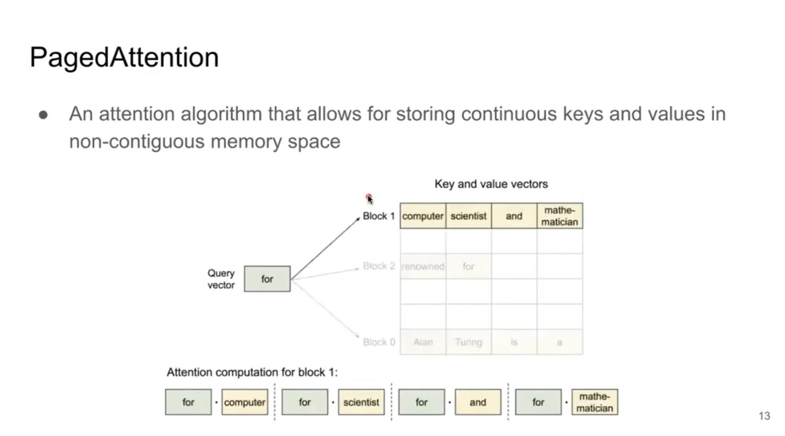
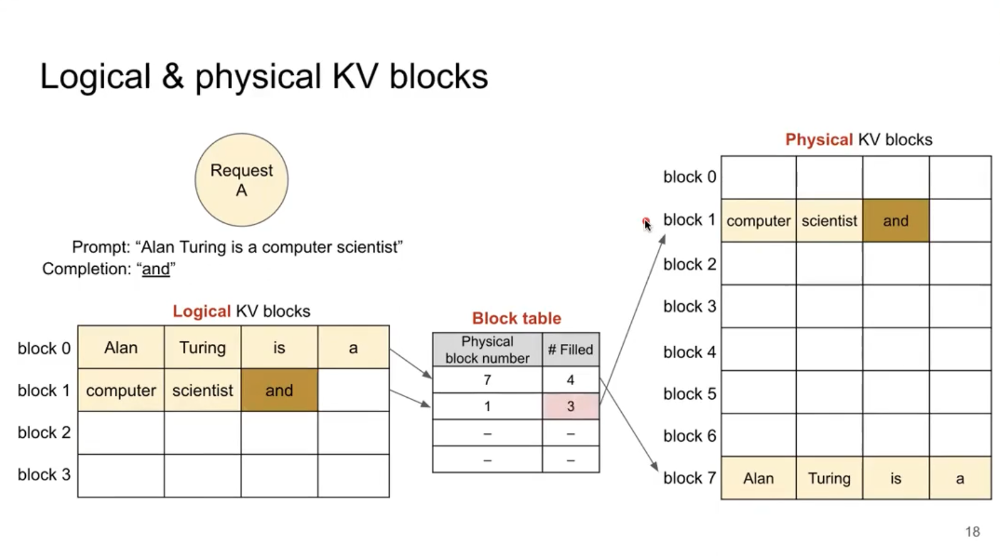
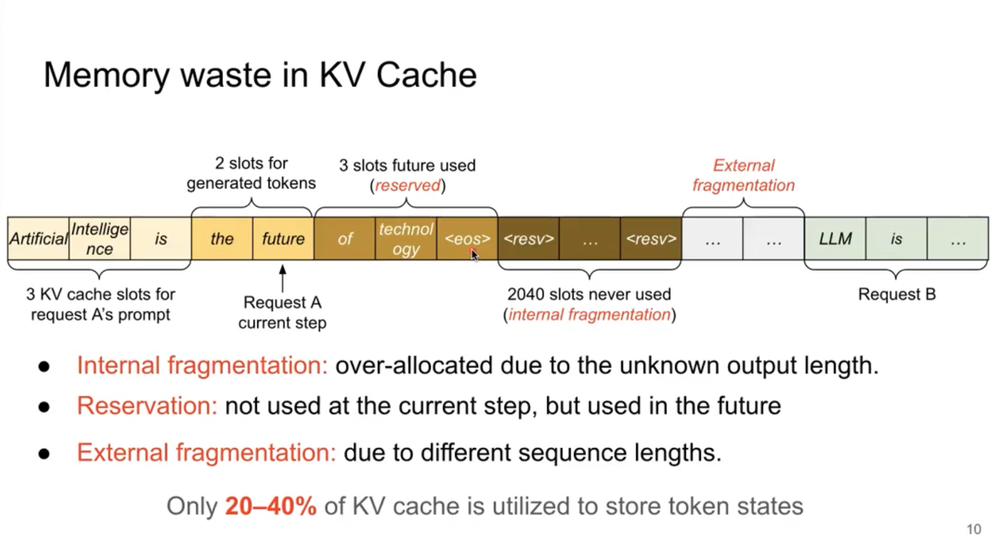
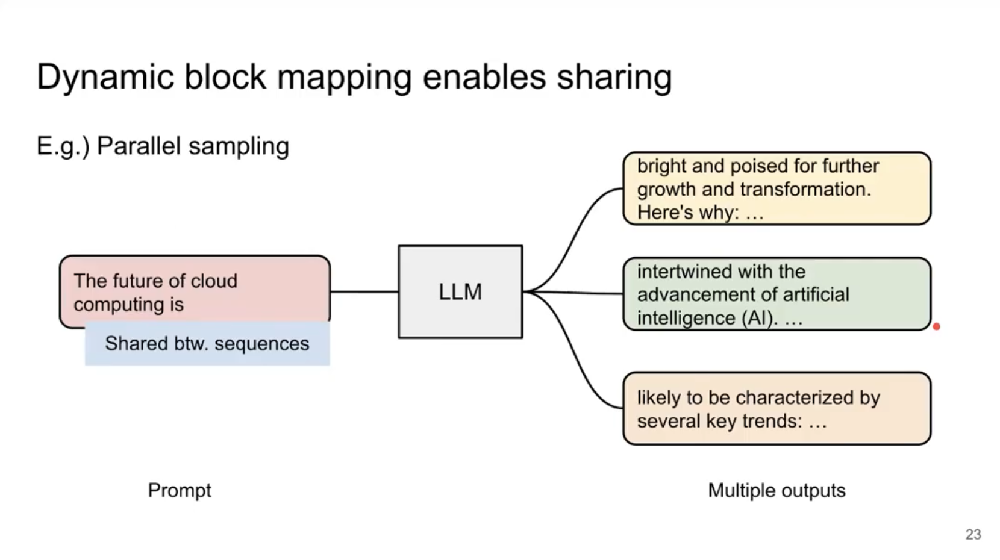
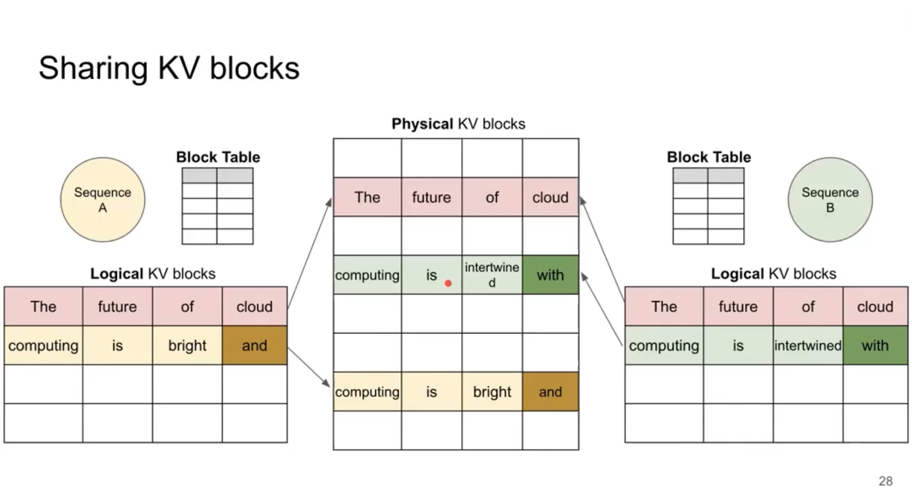

# Paged Attention 详解

> Slides 内容参考自 Zhuohan Li 在一次非正式会谈上对自己 vLLM 的一个介绍，这边把他的思路和做法呈现到这篇文档中
 

 
## Paged Attention 分页管理

* 物理块（Physical Blocks）: 实际存储KV数据的内存块
* 逻辑块（Logical Blocks）: 序列中的KV位置到物理块的映射
* 块表（Block Table）: 维护逻辑块到物理块的映射关系



## Paged Attention v.s. KV Cache

相比于 KV cache，Paged Attention 的优势体现在哪里呢？

### Memory waste in naive KV cache



由于传统的 KV cache 会一开始分配大量内存（比如最长上下文 4K），在对话内容较少的对话中就会造成空间冗余浪费。因此 Paged Attention 学习借鉴了
操作系统中的分页内存形式，把连续内存设置为多个 block，每一个 block 可以装下若干（32、64）个 tokens。同时由 vLLM 维护一个 Block table，
把一段对话的长上下文分配到若干个 block 中（可以是非连续的）。如果超出了当前块大小，就重新获取一个新的块用于存储当前的 KV cache，这样就能有效
减少块内的内存碎片。

同时为了避免预分配，Paged Attention 采用了动态分配（按需分配物理块）的方式，能有效优化内存访问模式，在异步并行的计算中能降低更多的内存碎片。

### Shared block 机制

如图所示是一个很常见的 LLM 分支，即为了产生多样性/回退等操作，在某一个地方我们得到了两条分叉之后的 token 生成路径。



在传统的 KV Cache 中，为了实现这一个操作，我们可能需要把一整个之前对话的 KV Cache 拷贝到另一个内存地址，然后在相同的 token 位置处进行并行的两支
运算。这样不仅耗费显存，而且减少了显存吞吐量。为了优化这一点，Paged Attention 采用共享机制，即运用 paged block 的优势，相同 prefix 的序列可
以共享物理块。但是为了避免出现 race，vLLM 引擎会维护一个 ref_num，如果生成出来的那个字符位置已经被占用，就会触发轻量的 block copy。这种机制被称为
copy-on-write。



据统计，传统 KV Cache 约有40%-60%的显存被浪费，但是依据 Paged Attention 机制的 vLLM 只有~4% 的内存浪费，这对于部署推理是非常史诗级的进步。

## API 设计

### Python 接口
```python
import paged_attention
output = paged_attention.forward(
    query,           # [batch_size, num_heads, head_dim]
    key_cache,       # [num_blocks, block_size, num_heads, head_dim]
    value_cache,     # [num_blocks, block_size, num_heads, head_dim]
    block_tables,    # [batch_size, max_blocks_per_seq]
    context_lens,    # [batch_size]
    block_size,      # int
    max_context_len, # int
)
```

### CUDA Kernel 接口
```c++
void paged_attention_cuda_forward(
    torch::Tensor out,
    torch::Tensor query,
    torch::Tensor key_cache,
    torch::Tensor value_cache,
    torch::Tensor block_tables,
    torch::Tensor context_lens,
    int block_size,
    int max_context_len,
);
```

